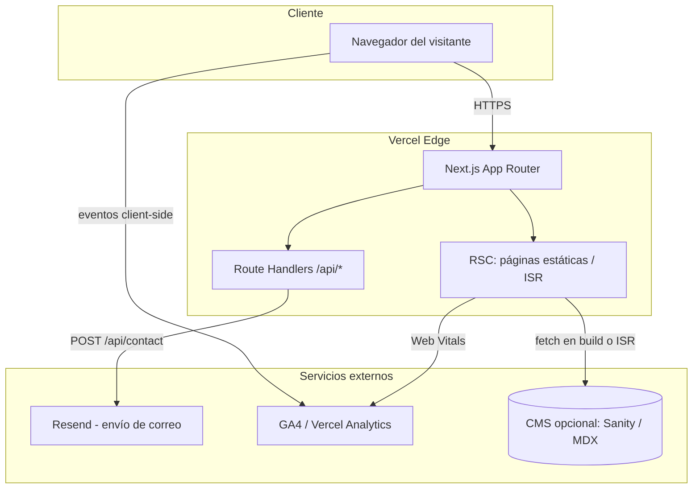

# Migración CONCIENTIC: Canva → Next.js (workflow en Kiro)

> **Nota de contexto:** concientic.com está publicado desde Canva Sites, que renderiza todo vía JS y no expone HTML/copy navegable. No pude extraer contenido real del sitio (secciones, copy exacto, paleta, tipografías). Por eso este plan empieza con una **Fase 0 de auditoría** que tú completas manualmente (o compartiendo capturas/PDF exportado desde Canva) antes de escribir la primera spec en Kiro. El resto del plan asume una estructura típica de landing de sistema de inteligencia digital (hero, propuesta de valor, pilares/servicios, metodología, casos, equipo, contacto) — ajusta las specs si tu estructura real difiere.

---

## 0. Cómo usar este documento con Kiro

Kiro trabaja con dos capas:

- **Steering** (`.kiro/steering/*.md`): contexto persistente del proyecto (producto, stack, convenciones). Se carga en cada sesión.
- **Specs** (`.kiro/specs/<feature>/`): por cada feature/página se generan `requirements.md` (historias de usuario + criterios en formato EARS: _"WHEN [evento] THE SYSTEM SHALL [comportamiento]"_), `design.md` (arquitectura técnica) y `tasks.md` (checklist ejecutable).

Flujo recomendado por fase de este plan:

1. Pega el **prompt de spec** de la fase en el chat de Kiro y selecciona "Create Spec" (o "Generate spec" si vienes de una conversación libre).
2. Revisa/edita `requirements.md` → aprueba → Kiro genera `design.md` → revisa → Kiro genera `tasks.md`.
3. Ejecuta tareas con "Start Task" o "Run all Tasks" (Kiro agrupa tareas independientes en oleadas paralelas).
4. Actualiza los steering docs conforme el proyecto evoluciona.

---

## 1. Plan de trabajo por fases

### Fase 0 — Auditoría de contenido y diseño (sin Kiro)

**Objetivo:** capturar toda la verdad del diseño actual antes de tocar código.

**Entregables:**

- Inventario de secciones y copy exacto (texto, CTAs, links).
- Paleta de color, tipografías, radios/sombras, breakpoints usados en Canva.
- Exportación de assets (logo, íconos, imágenes) en formato vectorial/alta resolución.
- Mapa de navegación (páginas/anclas, si es one-page o multi-página).
- Lista de integraciones actuales (formulario de contacto, analytics, redes).

**Cómo hacerlo:** exporta el diseño de Canva como PDF (design → share → download), o comparte capturas de cada sección conmigo; con eso puedo ayudarte a redactar el inventario y el copy deck. Como alternativa, deja registro versionado de la referencia visual en el repo (ej. capturas full-page por sección en `docs/reference/`) para poder comparar la migración contra el original en cualquier momento.

---

### Fase 1 — Setup del proyecto y steering en Kiro

**Objetivo:** dejar el repo y el contexto de Kiro listos.

**Entregables:** proyecto Next.js inicializado, steering docs (`product.md`, `structure.md`, `tech.md`), linting/formatting configurados.

**Prompt para Kiro (vibe/chat, no spec):**

```
Actúa como arquitecto frontend senior. Vamos a migrar el sitio CONCIENTIC (actualmente
diseñado en Canva) a Next.js (última versión estable, actualmente 16.x) con App Router +
TypeScript + Tailwind CSS. Verifica la versión estable vigente antes de inicializar.

1. Inicializa el proyecto con create-next-app (App Router, TypeScript, Tailwind, ESLint,
   src/ directory, import alias "@/*").
2. Instala y configura: shadcn/ui, next/font (Google Fonts o fuentes locales que te indique),
   framer-motion (para animaciones equivalentes a las de Canva), zod + react-hook-form
   (formulario de contacto), resend (envío de correo desde API route).
3. Configura Prettier + ESLint (airbnb o next/core-web-vitals) y Husky con pre-commit
   (lint + typecheck). Nota: el pre-commit local es una primera barrera de conveniencia;
   la validación autoritativa vive en CI (Fase 7). No bloquear flujos de emergencia que
   requieran `--no-verify`.
4. Crea la estructura de carpetas propuesta en docs/architecture.md (te la paso aparte).
5. Genera tres archivos de steering en .kiro/steering/:
   - product.md: describe qué es CONCIENTIC (sistema de inteligencia digital / consultoría
     de estrategia + producto + IA), su audiencia y objetivo de la landing.
   - tech.md: stack, convenciones de código, gestor de paquetes, targets de performance
     (Core Web Vitals) y accesibilidad (WCAG AA).
   - structure.md: convención de carpetas, naming de componentes, dónde va cada tipo de
     archivo (componentes UI, secciones de página, hooks, lib, tipos).
No implementes contenido de página todavía, solo el andamiaje.
```

---

### Fase 2 — Design system (tokens visuales)

**Objetivo:** traducir la identidad visual de Canva a tokens reutilizables antes de maquetar.

**Entregable:** `design.md` de un spec "design-system" con paleta, tipografía, espaciados, componentes base (Button, Badge, Card, Section wrapper).

**Prompt de spec para Kiro:**

```
Crea un spec llamado "design-system". Objetivo: implementar el sistema de diseño de
CONCIENTIC en Tailwind + shadcn/ui a partir de esta guía visual extraída de Canva:

- Colores: [pega aquí los hex exactos: primario, secundario, acento, neutros, fondo]
- Tipografías: [nombre de fuente de títulos] para headings, [nombre de fuente] para
  cuerpo. Escalas: H1 [tamaño], H2 [tamaño], body [tamaño].
- Radios de borde: [ej. 12px en cards, full en botones/pills]
- Sombras: [describir si son suaves/duras, con qué color de tinte]
- Espaciado base: [ej. escala de 4px u 8px]
- Breakpoints: mobile [ancho], tablet [ancho], desktop [ancho]

Requisitos (EARS):
- WHEN se defina un color de marca THE SYSTEM SHALL exponerlo como variable CSS y como
  token de Tailwind (tailwind.config.ts), no como valor hardcodeado en componentes.
- WHEN se use tipografía THE SYSTEM SHALL cargarla con next/font para evitar layout shift.
- WHEN se construya un componente base (Button, Badge, Card, SectionContainer) THE SYSTEM
  SHALL soportar variantes (ej. primary/secondary/ghost) vía class-variance-authority.
- WHEN el sitio se vea en modo oscuro (si aplica) THE SYSTEM SHALL usar tokens semánticos
  (bg-background, text-foreground) en vez de colores fijos.

Entrega también una página /design-system (solo dev) que muestre todos los tokens y
componentes base para validación visual rápida.
```

---

### Fase 3 — Estructura de páginas y secciones

**Objetivo:** maquetar cada sección del sitio como componente independiente, fiel al copy y jerarquía visual original.

**Entregable:** un spec por sección (o uno solo "landing-page" si el sitio es one-page corto). Ejemplo de spec para el Hero:

**Prompt de spec para Kiro:**

```
Crea un spec llamado "landing-hero". Migramos la sección Hero del sitio actual (Canva)
a un componente React server/client según corresponda.

Contenido real de la sección (copiar tal cual del sitio actual):
- Titular: "[pegar copy exacto]"
- Subtítulo: "[pegar copy exacto]"
- CTA primario: "[texto del botón]" → enlaza a [ancla o página]
- CTA secundario (si existe): "[texto]"
- Imagen/ilustración: [describir o adjuntar]

Requisitos (EARS):
- WHEN la página cargue en viewport móvil THE SYSTEM SHALL apilar texto e imagen
  verticalmente, manteniendo el CTA visible sin scroll.
- WHEN el usuario haga click en el CTA primario THE SYSTEM SHALL hacer scroll suave a la
  sección de contacto (o navegar a /contacto si es multi-página).
- WHEN se use animación de entrada THE SYSTEM SHALL respetar prefers-reduced-motion.
- WHEN se mida performance THE SYSTEM SHALL servir la imagen del hero con next/image,
  priority=true y tamaños responsivos (no bloquear LCP).

Diseño: usa los tokens definidos en el spec "design-system". El componente vive en
src/components/sections/hero.tsx y se consume desde app/page.tsx.
```

> Repite esta misma plantilla para cada sección real del sitio (propuesta de valor, pilares/servicios, metodología, casos de éxito, equipo, contacto, footer), reemplazando el copy y los requisitos específicos de interacción de cada una (ej. carrusel de casos, acordeón de metodología, formulario de contacto).

**Prompt de spec para el formulario de contacto (suele ser la parte con más lógica):**

```
Crea un spec llamado "contact-form". Formulario de contacto de CONCIENTIC.

Campos: nombre, correo, empresa (opcional), mensaje, [checkbox de política de datos].

Requisitos (EARS):
- WHEN el usuario envíe el formulario con datos válidos THE SYSTEM SHALL enviar un correo
  vía API route (/api/contact) usando Resend, y mostrar confirmación inline sin recargar.
- WHEN el usuario envíe datos inválidos THE SYSTEM SHALL mostrar errores de validación por
  campo usando react-hook-form + zod, sin perder los valores ya escritos.
- WHEN falle el envío (error de red o del servicio de correo) THE SYSTEM SHALL mostrar un
  mensaje de error y permitir reintentar sin perder los datos.
- WHEN se envíe el formulario THE SYSTEM SHALL aplicar rate limiting por IP para evitar
  spam. En Vercel (serverless, funciones efímeras sin estado compartido) NO usar memoria
  en proceso; usar un store distribuido: Vercel KV / Upstash Redis (@upstash/ratelimit) o
  el rate limiting del Vercel WAF. Documentar la elección y los límites (ej. 5 req/min/IP)
  en design.md.
- WHEN el formulario se muestre THE SYSTEM SHALL ser accesible por teclado y con labels
  asociados correctamente (WCAG AA).
```

---

### Fase 4 — Contenido dinámico (opcional, según necesidad real)

**Objetivo:** decidir si el contenido vive hardcodeado en componentes (suficiente para una landing estática) o si necesitas editarlo sin tocar código (ej. si CONCIENTIC va a publicar casos/blog con frecuencia, similar a lo que haces con DQnexus).

**Prompt de spec para Kiro (solo si aplica CMS):**

```
Crea un spec llamado "content-cms". Necesitamos que las secciones "Casos de éxito" y
"Blog/Recursos" sean editables sin deploy.

Requisitos (EARS):
- WHEN se agregue o edite un caso de éxito en el CMS THE SYSTEM SHALL reflejarlo en el
  sitio sin necesidad de un nuevo deploy manual (usar ISR/revalidateTag).
- WHEN se consulte el contenido THE SYSTEM SHALL tipar la respuesta con TypeScript
  generado desde el esquema del CMS.
- WHEN el CMS no responda THE SYSTEM SHALL degradar a un fallback estático (contenido
  cacheado) en vez de romper la página.

Evalúa dos opciones y documenta trade-offs en design.md: (a) Sanity (schema-as-code,
buen editor visual), (b) MDX local en el repo (cero costo, requiere PR para publicar).
Recomienda una según el volumen de publicación esperado.
```

---

### Fase 5 — SEO, performance y accesibilidad

**Prompt de spec para Kiro:**

```
Crea un spec llamado "seo-perf-a11y" para el sitio completo.

Requisitos (EARS):
- WHEN cualquier página se indexe THE SYSTEM SHALL exponer metadata (title, description,
  Open Graph, Twitter Card) vía la Metadata API de Next.js, con valores por sección.
- WHEN se genere el sitio THE SYSTEM SHALL incluir sitemap.xml y robots.txt automáticos.
- WHEN se cargue cualquier imagen THE SYSTEM SHALL usar next/image con dimensiones
  explícitas para evitar CLS.
- WHEN se audite con Lighthouse THE SYSTEM SHALL alcanzar >=90 en Performance,
  Accessibility, Best Practices y SEO en desktop y >=80 en mobile.
- WHEN se navegue solo con teclado THE SYSTEM SHALL permitir acceder a todos los CTAs y
  al formulario, con foco visible.
- WHEN se mida Core Web Vitals en producción THE SYSTEM SHALL registrar LCP, CLS e INP
  vía Vercel Analytics o equivalente.

Incluye en design.md un checklist de auditoría pre-lanzamiento. Nota: el score de
Accessibility de Lighthouse es automático y NO garantiza cumplimiento WCAG AA; la
validación real requiere pruebas manuales con lector de pantalla (NVDA/VoiceOver),
navegación solo por teclado y revisión de contraste/foco por experto.
```

---

### Fase 6 — Integraciones y analítica

**Entregables:** Google Analytics 4 (o Plausible), pixel/eventos de conversión en el CTA principal, verificación de dominio en Search Console.

**Prompt de spec para Kiro:**

```
Crea un spec llamado "analytics-integrations".

Requisitos (EARS):
- WHEN un usuario cargue cualquier página THE SYSTEM SHALL registrar una vista de página
  en GA4. Decidir explícitamente en Fase 0/6 si habrá banner de consentimiento de cookies;
  si aplica, inicializar GA4 con Consent Mode v2 (estado "denied" por defecto y actualizar
  al aceptar).
- WHEN un usuario haga click en un CTA de contacto THE SYSTEM SHALL disparar un evento
  "cta_click" con la ubicación del CTA como parámetro.
- WHEN un usuario complete el formulario de contacto THE SYSTEM SHALL disparar un evento
  de conversión "lead_submitted".
- WHEN se despliegue a producción THE SYSTEM SHALL usar variables de entorno separadas
  para IDs de analítica en preview vs producción.
```

---

### Fase 7 — QA, CI/CD y deployment

**Prompt de spec para Kiro:**

```
Crea un spec llamado "ci-cd-deploy".

Requisitos (EARS):
- WHEN se abra un pull request THE SYSTEM SHALL correr lint, typecheck y build en CI
  (GitHub Actions) antes de permitir merge.
- WHEN se haga push a main THE SYSTEM SHALL desplegar automáticamente a Vercel producción.
- WHEN se abra un PR THE SYSTEM SHALL generar un preview deploy con URL única.
- WHEN se conecte el dominio concientic.com THE SYSTEM SHALL configurar redirects 301
  desde las rutas antiguas de Canva (si difieren) hacia las nuevas.
- WHEN el build falle THE SYSTEM SHALL bloquear el deploy y notificar el motivo.

Documenta en tasks.md los pasos de corte de tráfico: DNS, verificación SSL, y ventana de
rollback si algo falla post-lanzamiento.
```

---

### Fase 8 — Lanzamiento y monitoreo

- Cambio de DNS/dominio a Vercel.
- Verificación de redirects, formulario en producción, analítica disparando eventos reales.
- Monitoreo de Core Web Vitals la primera semana y ajuste fino.

---

## 2. Propuesta de arquitectura

### 2.1 Stack recomendado

| Capa                 | Elección                                                                                                                 | Motivo                                                                                |
| -------------------- | ------------------------------------------------------------------------------------------------------------------------ | ------------------------------------------------------------------------------------- |
| Framework            | Next.js (última estable, 16.x al momento de escribir; verificar antes de arrancar) — App Router, React Server Components | SEO nativo, SSG/ISR para landing, buen soporte en Vercel                              |
| Lenguaje             | TypeScript                                                                                                               | Contratos de datos claros para specs de Kiro                                          |
| Estilos              | Tailwind CSS + shadcn/ui                                                                                                 | Tokens rápidos de mapear desde el diseño de Canva, componentes accesibles por defecto |
| Animación            | Framer Motion                                                                                                            | Para replicar transiciones/entradas que Canva aplica de forma nativa                  |
| Formularios          | react-hook-form + zod                                                                                                    | Validación tipada, buena DX con Kiro generando specs con criterios EARS               |
| Envío de correo      | Resend (o SES si ya usas AWS)                                                                                            | API simple desde route handler                                                        |
| Contenido            | MDX local (o Sanity si habrá publicación frecuente)                                                                      | Ver Fase 4                                                                            |
| Hosting              | Vercel                                                                                                                   | Preview deploys por PR, Edge Network, integración nativa con Next.js                  |
| Analítica            | GA4 + Vercel Analytics                                                                                                   | Eventos de conversión + Web Vitals reales                                             |
| Control de versiones | GitHub + Actions                                                                                                         | CI antes de cada deploy                                                               |

### 2.2 Diagrama de arquitectura



### 2.3 Estructura de carpetas

```
concientic/
├── .kiro/
│   ├── steering/
│   │   ├── product.md
│   │   ├── tech.md
│   │   └── structure.md
│   └── specs/
│       ├── design-system/
│       ├── landing-hero/
│       ├── contact-form/
│       └── ...
├── src/
│   ├── app/
│   │   ├── layout.tsx
│   │   ├── page.tsx                # landing (o /[locale] si hay multi-idioma)
│   │   ├── api/
│   │   │   └── contact/route.ts
│   │   └── sitemap.ts / robots.ts
│   ├── components/
│   │   ├── ui/                     # primitives shadcn (button, card, badge...)
│   │   └── sections/                # hero.tsx, pillars.tsx, methodology.tsx, cases.tsx, contact.tsx, footer.tsx
│   ├── lib/
│   │   ├── validations/             # esquemas zod
│   │   └── email.ts
│   ├── content/                     # MDX/JSON si no hay CMS externo
│   └── styles/
│       └── globals.css              # tokens de color como CSS variables
├── public/
│   └── assets/ (logo, imágenes exportadas de Canva en alta res)
├── tailwind.config.ts
└── next.config.ts
```

### 2.4 Flujo de datos clave

- **Landing estática:** contenido en `src/content/` o componentes, generado en build (SSG). Sin necesidad de servidor en cada request.
- **Formulario de contacto:** cliente → `POST /api/contact` (Route Handler) → validación zod → Resend → respuesta JSON → UI actualiza estado sin recarga.
- **Contenido dinámico (si hay CMS):** build/ISR hace fetch al CMS; `revalidateTag` permite refrescar una sección puntual sin rehacer todo el build.
- **Analítica:** eventos client-side (clicks, envíos) vía GA4; Web Vitals reales capturados por Vercel Analytics.

### 2.5 Consideraciones de performance/SEO

- Priorizar imagen del hero (`priority`) y lazy-load para el resto.
- Metadata por sección vía Metadata API (no meta tags manuales).
- Fuentes con `next/font` (self-hosted, sin bloqueo de render).
- Sitemap y robots generados, no estáticos a mano, para que sigan al agregar páginas.

---

## 3. Próximos pasos sugeridos

1. Completa la Fase 0 (auditoría) — puedo ayudarte a estructurar el copy deck si me compartes capturas o el PDF exportado de Canva.
2. Pega el prompt de la Fase 1 en Kiro para dejar el proyecto andando.
3. Vamos sección por sección con specs (Fase 3), validando visualmente contra el diseño original antes de avanzar a la siguiente.
